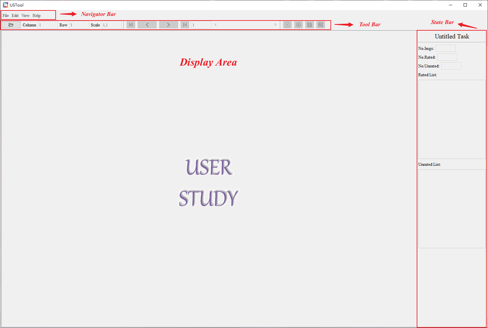
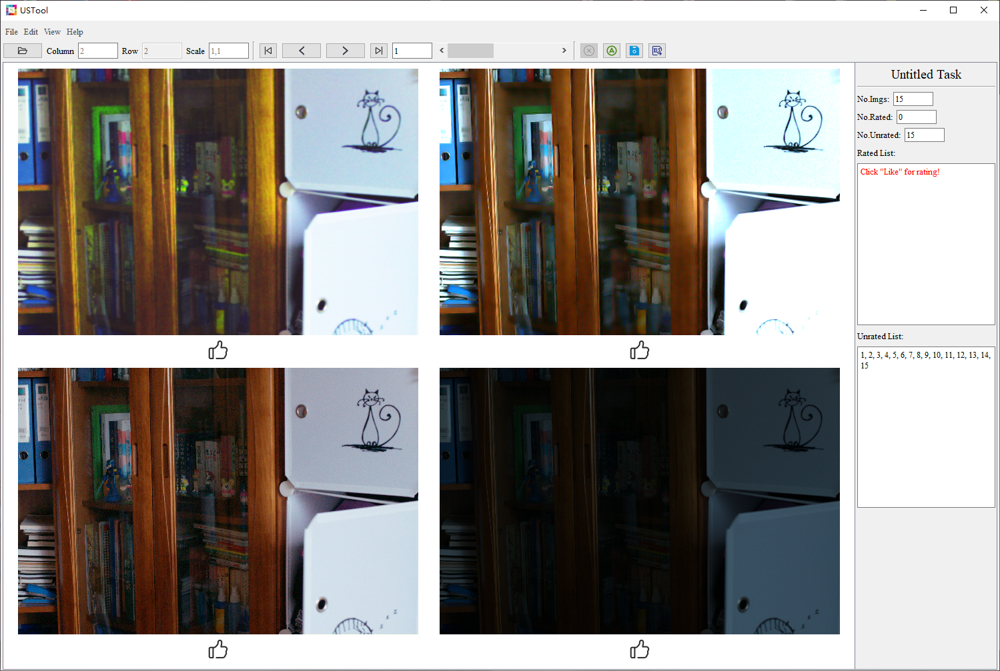
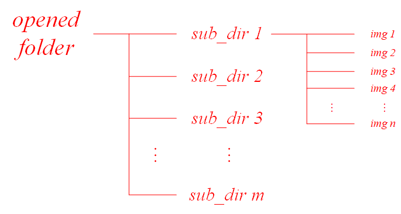
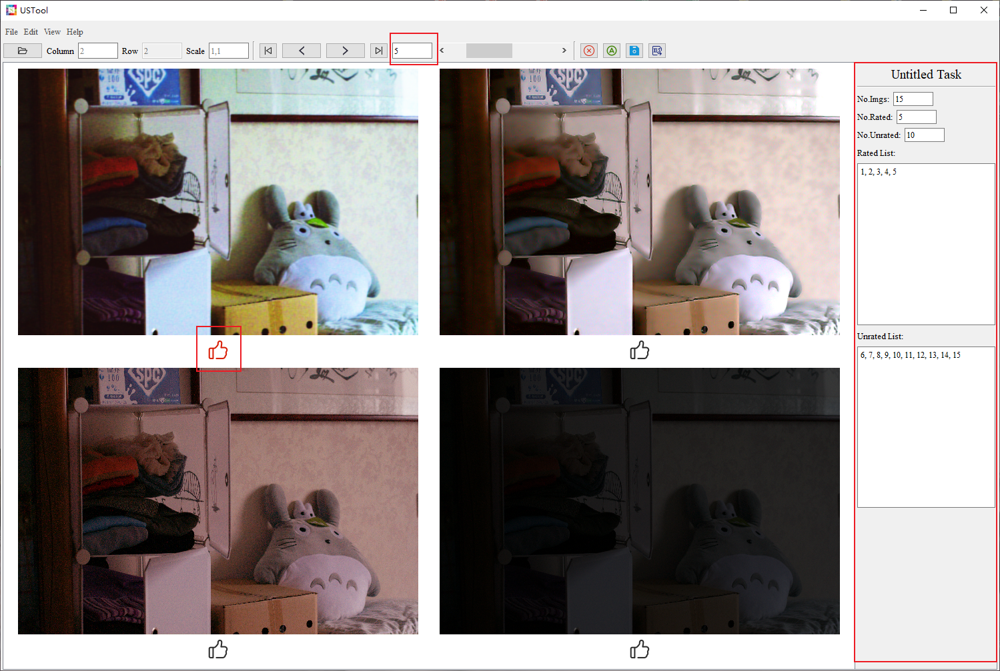
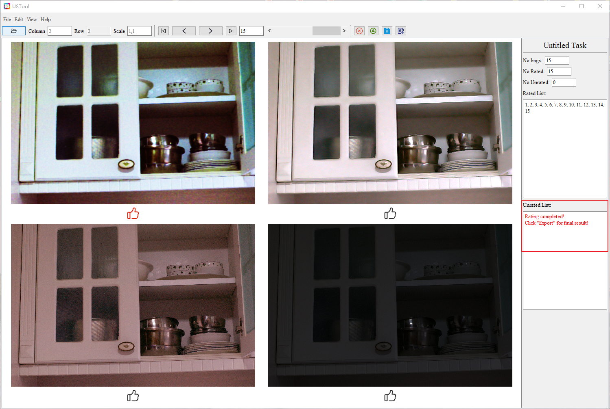
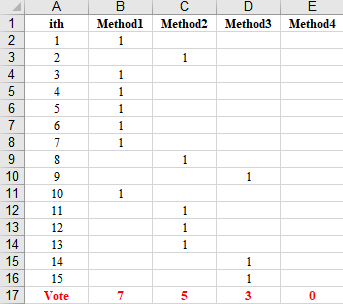

# UserStudyTool
This is a handy tool for user study. With this tool, you can simultaneously view and rate a group of images, and the rating result can be saved to a .xls table.

<div align=center></div>

## Version
**Latest version (v1.0.0)：** [[View]](https://github.com/suiyizhao/UserStudyTool/releases/tag/v1.0.0) [[Download]](https://github.com/suiyizhao/UserStudyTool/releases/download/v1.0.0/USTool.exe)

## Basic Usage
1. **Open the software**



2. **File -> New Task: Open a folder to be displayed**



*The format of the folder should meet the following：*



3. **Click the "Like" button below the image to vote**



4. **Continue until each group of images has been rated**



5. **Export the rating result to a .xls table**



## Detailed description for tool bar (from left to right)

| Component         | Description                                                                     | Range                              | Note                                                     |
| :---              |              :----:                                                             |     :----:                         |    :----:                                                |
| Open Folder       | Open a folder to be displayed                                                   | N/A                                | None                                                     |
| Column            | Determine how many columns to display                                           | Min:1; Max:Number of sub-folders   | None                                                     |
| Row               | Determine how many rows to display                                              | Min:1; Max:Number of sub-folders   | Automatically set based on column                        |
| Scale             | Determine what size to display                                                  | Min:0.1; Max:10                    | Format: width-scale,height-scale, e.g., 0.5,1.5          |
| Previous unrated  | Jump to previous unrated image                                                  | N/A                                | None                                                     |
| Previous          | Jump to previous image (whether rated or unrated)                               | N/A                                | None                                                     |
| Next              | Jump to next image (whether rated or unrated)                                   | N/A                                | None                                                     |
| Next unrated      | Jump to next unrated image                                                      | N/A                                | None                                                     |
| Serial/Scrollbar  | Jump to the image specified by the serial/scrollbar                             | Min:1; Max:Number of images        | None                                                     |
| Cancel like       | Cancel the clicked "Like"                                                       | N/A                                | None                                                     |
| Auto next         | Determine whether to automatically display the next one after clicking "Like"   | N/A                                | None                                                     |
| Save              | Save a task                                                                     | N/A                                | None                                                     |
| Export            | Export the final result to a .xls table                                         | N/A                                | None                                                     |

## Ideas or bugs
If you **have any ideas to help improve the software** or **find any bugs**.

Please give us feedback in ISSUES!

## Cite
If you find this repository helpful in your research, please cite the following BibTex item:
```
@software{USTool,
  author  = {Suiyi Zhao},
  title   = {USTool: A handy tool for user study},
  url     = {https://github.com/suiyizhao/UserStudyTool},
  year    = {2023}
}
```
