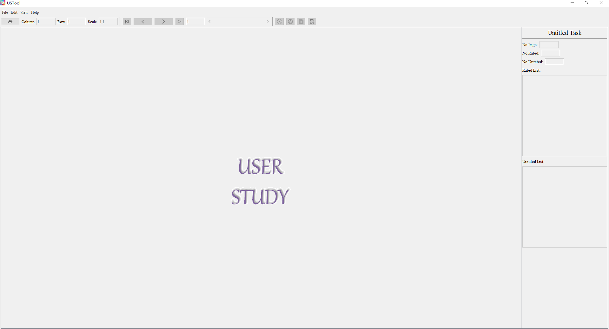
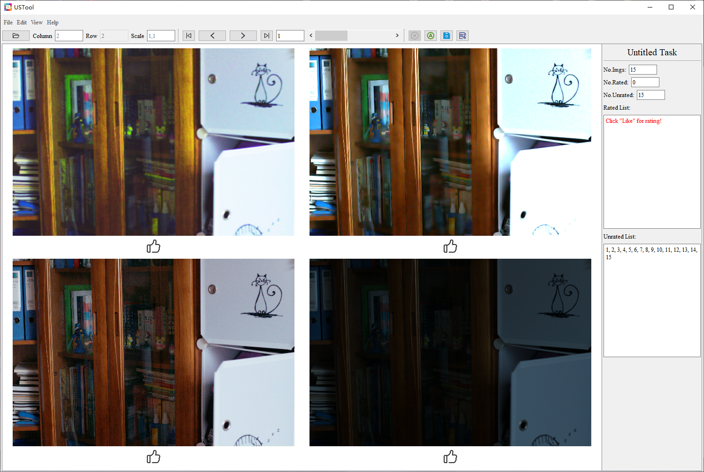
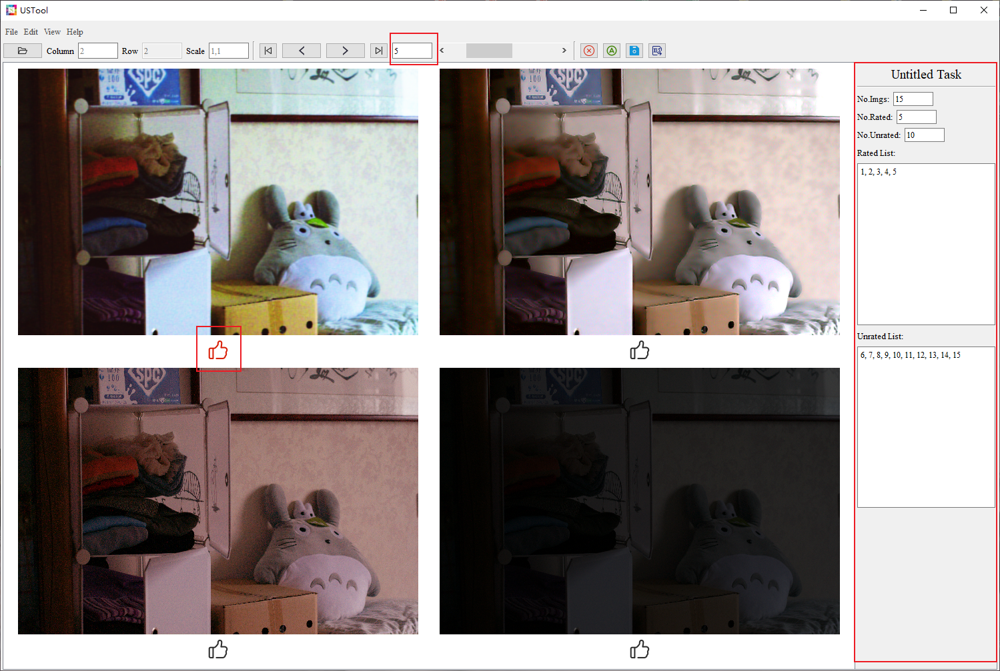
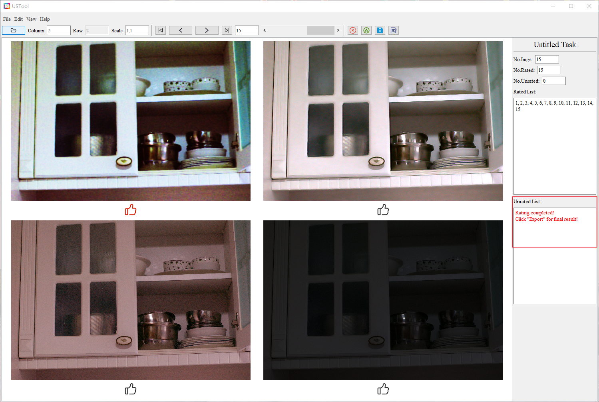
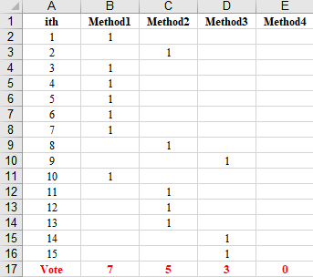

# UserStudyTool
This is a handy tool for user study. With this tool, you can simultaneously view and rate a group of images, and the rating results can be saved to a .xls table.

## Basic Usage
1. Open the software

2. File -> New Task: Open a folder to be displayed

3. Click the "Like" button below the image to vote

4. Continue until each group of images has been rated

5. Export the rating result to a .xls table

